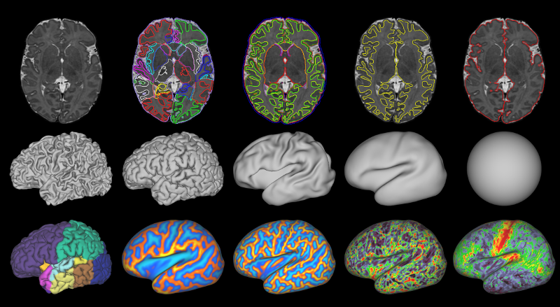

# dHCP Structural Pipeline

The dHCP structural pipeline is a software for the structural analysis of the neonatal brain MRI (T1 and T2) that consists of: 
* cortical and sub-cortical volume segmentation
* cortical surface extraction (white matter and pial surface)
* cortical surface inflation and 
* projection to sphere

## Publication
The pipeline is described in detail in:

A. Makropoulos and E. C. Robinson et al. "The Developing Human Connectome Project: a Minimal Processing Pipeline for Neonatal Cortical Surface Reconstruction (<a href="http://biorxiv.org/content/early/2017/04/07/125526">link</a>)

## Authors
<b>Antonios Makropoulos</b>: main author, development of the structural pipeline, and segmentation software <a href="https://amakropoulos.github.io/">more</a>

<b>Andreas Schuh</b>: contributor, development of the cortical surface extraction, and surface inflation software <a href="http://andreasschuh.com">more</a>

<b>Robert Wright</b>: contributor, development of the spherical projection software

## License
The dHCP structural pipeline is distributed under the terms outlined in LICENSE.txt

## Installation
The installation requires <b>FSL</b> and the <b>packages</b> specified in the <b>Dependencies</b> section. 
After installing these dependencies, the pipeline is installed by running:
* ./setup.sh -j [num_cores] 

where [num_cores] the number of CPU cores used to compile the pipeline software 
 

The setup script installs the following software packages.
   
| Software        | Version           
| ------------- |:-------------:|
| <a href="https://github.com/InsightSoftwareConsortium/ITK">ITK</a>      | 4.11.1 
| <a href="https://github.com/Kitware/VTK">VTK</a>      | 7.0.0     
| <a href="https://github.com/Washington-University/workbench">Connectome Workbench</a>  | 1.2.2  
| <a href="https://github.com/BioMedIA/MIRTK">MIRTK</a>  | 88c8266b016b465551d0bbafca9aed6340fdc1fb  
| <a href="https://gitlab.doc.ic.ac.uk/am411/SphericalMesh/">SphericalMesh</a>  | 0fb416cf88ba33e99df5e57b90281171f0f34005  

The '-h' argument can be specified to provide more setup options:
* ./setup.sh -h

Once the installation is successfully completed, if desired, the different pipeline commands can be included in the shell PATH by running:
* . parameters/path.sh

## Dependencies
#### 1. FSL
The dHCP structural pipeline uses the <b>FSL</b> software. This can be installed by following the instructions:

* Ubuntu / Debian GNU:  
  http://neuro.debian.net/install_pkg.html?p=fsl-complete

* Mac OS X / Red Hat Enterprise Linux / CENTOS:  
  https://fsl.fmrib.ox.ac.uk/fsl/fslwiki/FslInstallation

The FSL software needs to be configured for <b>shell usage</b>:
* https://fsl.fmrib.ox.ac.uk/fsl/fslwiki/FslInstallation/ShellSetup

#### 2. Packages
The dHCP structural requires installation of the following packages.
#### Ubuntu (tested on version 16.04) / Debian GNU (tested on version 8):
* sudo apt-get -y update
* sudo apt-get -y install g++ git cmake unzip bc python python-contextlib2 libtbb-dev libboost-dev zlib1g-dev libxt-dev libgstreamer1.0-dev libqt4-dev

#### Mac OS X (tested on version 10.9.5):
* # install brew if needed with the following command
* ruby -e "$(curl -fsSL https://raw.githubusercontent.com/Homebrew/install/master/install)"
* brew update
* brew install gcc git cmake unzip tbb boost cartr/qt4/qt
* sudo easy_install pip
* pip install contextlib2

#### Red Hat Enterprise Linux (tested on version 7.3):
* sudo yum -y update
* sudo yum -y install gcc-c++ git cmake unzip bc python tbb-devel boost-devel qt-devel zlib-devel libXt-devel gstreamer1-devel
* # the epel-release-latest-7.noarch.rpm is for version 7 of RHEL, this needs to be adjusted for the user's OS version
* curl -o epel.rpm https://dl.fedoraproject.org/pub/epel/epel-release-latest-7.noarch.rpm
* sudo yum -y install epel.rpm
* sudo yum -y install python-contextlib2

#### CENTOS (tested on version 7):
* sudo yum -y update
* sudo yum -y install gcc-c++ git cmake unzip bc python tbb-devel boost-devel qt-devel zlib-devel libXt-devel gstreamer1-devel 
* sudo yum -y install epel-release
* sudo yum -y install python-contextlib2

## Run

The pipeline can be run with the following command:

./dhcp-pipeline.sh [subject_ID] [session_ID] [scan_age] -T2 [T2_image] \( -T1 [T1_image] \) \( -t [num_threads] \)

where:

| Argument        | Type      | Description     
| ------------- |:-------------:| :-------------:|
| subject_ID| string | Subject ID
| session_ID| string | Session ID
| scan_age| double |Subject post-menstrual age (PMA) in weeks (number between 28-44).  If the age is <28w or >44w, it will be set to 28w or 44w respectively.
| T2_image| nifti image | The T2 image of the subject
| T1_image| nifti image |The T1 image of the subject (Optional)
| num_threads| integer |Number of threads (CPU cores) used (default: 1) (Optional)

Examples:
* ./dhcp-pipeline.sh subject1 session1 44 -T2 subject1-T2.nii.gz -T1 subject1-T1.nii.gz -t 8
* ./dhcp-pipeline.sh subject2 session1 36 -T2 subject2-T2.nii.gz -T1 subject2-T1.nii.gz 
* ./dhcp-pipeline.sh subject3 session4 28 -T2 subject3-T2.nii.gz 

If the user would like to execute a specific script of the pipeline (e.g. scripts/segmentation/pipeline.sh ), the following command needs to be run first in order to setup the environment:
* . parameters/configuration.sh